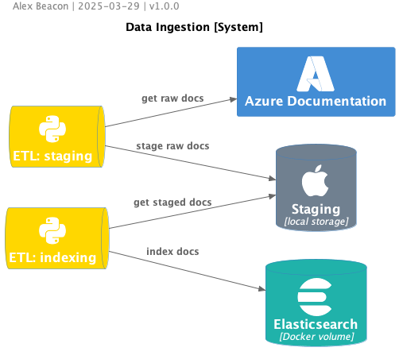

# Commuter Copilot
Commuter Copilot is a RAG-based, offline coding assistant. Inspiration for this project came when my commute changed & I found the new route had terrible cell/hotspot/wifi service. My solution was to develop a containerized app so I can run an LLM locally. To improve responses, I indexed tech documentation that was published after the model's knowledge cutoff.  

## design draft


## etl

### step 1a: shallow clone of Azure repo  
- only runs once
- clone top level of main branch only - don't need commit history or other branches for anything at this time
- manual step:  
  `> git clone --branch main --single-branch --depth 1 https://github.com/MicrosoftDocs/azure-docs.git`
- writes to:  
  `../azure-docs`  
  
### step 1b: update Azure raw docs
- should happen regularly to update knowledge base with latest documentation
- pull updates from [MicrosoftDocs/azure-docs](https://github.com/MicrosoftDocs/azure-docs) to my local storage.  

### step 2: process raw docs
- find all md files in repo
- pull out frontmatter & parse as metadata
- split document into sections (`# ` used as delimiter)
- subdivided into chunks of approximately 200 words

### step 3: index docs to elasticsearch index
- connect to ES client
- write/update docs to index   
  
**schema**
```json
{
  "id": "keyword",  
  "filename": "keyword",  
  "path": "keyword",  
  "title": {
      "type": "text",
      "fields": {
          "raw": { "type": "keyword" }
      }
  },
  "content": "text",  
  "metadata": {  
       "description": "text",  
       "ms.date": { "type": "date" },  
       "ms.topic": "keyword"  
  },
  "sections": {
       "type": "nested", 
       "properties": {
            "section_content": "text",  
            "chunks": {
                "type": "text"
            }
       }
  }
}
```

**todo**:  
- convert to python module
- script extraction step
- repeat for python, docker, react, langchain(?), etc.
  
  
<hr>
<hr>  
  
## query service
### retrieve docs
- write a query using filters
- design for expansion to other doc
  
### augment prompt
- write prompt template for coding assistant
  
### generate response
- add deepseek
  
  
<hr>
<hr>  
  
## ui
<hr>
<hr>  
  
## logging/monitoring
  
<hr>
<hr>  
  